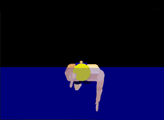
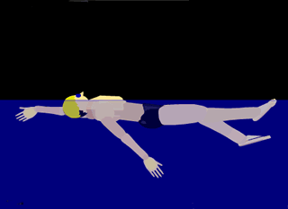
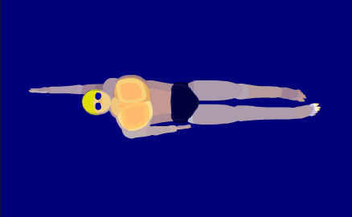

# Backstroke

<figure markdown="span">
    { width="500" }
    <figcaption>Backstroke (images from <a href="https://arenaswim.com/">Arena Swim</a>)</figcaption>
</figure>

Backstroke (back crawl) is the only competitive swim stroke that is swum on the back.
Because of this, backstroke has the advantage of easy breathing, but the disadvantage of swimmers not being able to see where they are going.

## **Tips**

{ align=right width="180" }

Similar to freestyle, backstroke depends on rotations about the long-axis of the swimmer (the spine).
The purpose of the rotation is *not* to pull deep underwater but instead to allow the arm to the farthest above the head for the catch.

The arms should **NOT** be straight during the pull.
Analogous to the recovery of freestyle, the arms are bent underwater.
The arms bend after the catch, and the water pushed to the side and then below the swimmer.
Straights should be avoided as it can lead to shoulder damage.

{ align=right width="180" }

Notice both arms are opposite of each other: as one is pulling, the other is recovering; as one enters the water, the other exits.
Doing this is critical to provide constant movement.

In addition, the hands rotate about the arm while recovering.
The thumb should be the first to surface, and the pinkie should be the first to submerge.
This rotation requires a straight arm moving from the swimmers side to above their head.

{ align=right width="180" }

Like freestyle, backstroke uses a strong and fast flutter kick.
Kicks starting from the hip with pointed feet and a slight bend in the knee provides constant forward progress.

Although the swimmer is on their back and has ample time to breath, rhythmic breathing is still necessary to keep endurance.
When the breaths occur is up to the swimmer.
As an example, one could breathe in while the right hand recovers and then exhale as the left hand recovers.

The following is a chart of skills that will enhance a swimmers backstroke.

+----------+--------------------------------------------------+
| Lesson   | Skill                                            |
+==========+==================================================+
| Stroke   | * stay on back                                   |
|          |                                                  |
|          | * accurate stroke count                          |
|          |                                                  |
+----------+--------------------------------------------------+
| Kick     | * kick rapidly and small                         |
|          |                                                  |
|          | * kick from hip                                  |
|          |                                                  |
|          | * legs straight (slightly bend)                  |
|          |                                                  |
|          | * feet pointed                                   |
|          |                                                  |
+----------+--------------------------------------------------+
| Pull     | * pull with bent arms                            |
|          |                                                  |
|          | * pull along side                                |
|          |                                                  |
|          | * pull water down on finish                      |
|          |                                                  |
|          | * arms opposite (one pulls, one recovers)        |
|          |                                                  |
|          | * shoulders rotate                               |
|          |                                                  |
|          | * recover with thumb out, pinkie in              |
|          |                                                  |
|          | * recover with straight arms                     |
|          |                                                  |
+----------+--------------------------------------------------+
| Breakout | * underwater dolphin or flutter kicks            |
|          |                                                  |
|          | * initial stroke with one arm pull               |
|          |                                                  |
|          | * one hand touch on finish                       |
|          |                                                  |
|          | * flip turn                                      |
|          |                                                  |
+----------+--------------------------------------------------+

## **Rules**

The following are the rule for backstroke as defined by USA Swimming.
The backstroke rules are defined in Part 1, Article 101, Section 101.4 in the [USA Swimming Rulebook](https://websitedevsa.blob.core.windows.net/sitefinity/docs/default-source/governance/governance-lsc-website/rules_policies/rulebooks/2024-rulebook.pdf).
See [USA Swimming Rules & Policies](https://www.usaswimming.org/about-usas/governance/rules-policies) for more information.

**101.4** BACKSTROKE

1. **Start** --
The swimmers shall line up in the water facing the starting end, with both hands placed on the gutter or on the starting grips.
Standing in or on the gutter, placing the toes above the lip of the gutter, or bending the toes over the lip of the gutter, before or after the start, is prohibited.
When using a backstroke ledge at the start, at least one toe of both feet must be in contact with the end wall or face of the touchpad.
Bending the toes over the top of the touchpad is prohibited.

2. **Stroke** --
The swimmer shall push off on his back and continue swimming on the back throughout the race.
Some part of the swimmer must break the surface of the water throughout the race, except it is permissible for the swimmer to be completely submerged during the turn and for a distance of not more than 15 meters (16.4 yards) after the start and after each turn.
By that point, the head must have broken the surface of the water.
Additionally, once some part of the head of the swimmer has passed the final 5-meter mark (long course and short course meters) or 5-yard mark (short course yards), immediately prior to reaching for the finish, the swimmer may be completely submerged prior to the touch.

3. **Turns** --
Upon completion of each length, some part of the swimmer must touch the wall.
During the turn the shoulders may be turned past the vertical toward the breast after which an immediate continuous single arm pull or immediate continuous simultaneous double arm pull may be used to initiate the turn.
The swimmer must have returned to a position on the back upon leaving the wall.

4. **Finish** --
Upon the finish of the race, the swimmer must touch the wall while on the back.
