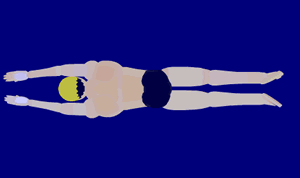

# Breaststroke

<figure markdown="span">
    { width="500" }
    <figcaption>Backstroke (images from <a href="https://arenaswim.com/">Arena Swim</a>)</figcaption>
</figure>

Breaststroke is a symmetric swimming stroke in which the swimmer is on their chest and the torso does not rotate with a whip ("frog") kick and an underwater recovery.
It is the slowest of the four competitive strokes, however the skill to swim breaststroke fast requires strength and endurance comparable to other strokes.

## **Tips**

{ align=right width="180" }

Every stroke consists of one pull and one kick.
There is a small amount of time when the legs start moving while arms are finishing the pull and starting the recovery.
Notice that the arms stay at the swimmer's chest; pulling lower, past the hips, is illegal.
The kick is a circular motion called the whip kick.

A kick follows the saying: Up, Out, Around.

* The feet move up to the hips; toes move from pointed to flexed.
* The feet point outward to each direction.
* The feet "whip" around in a circular motion, squeezing the water between the legs together, and return to the original straight legs, pointed toes position.

A pull follows the saying: Out, In, Forward.

* The arms pull outward in each direction in a circular motion.
* The arms fold upwards and inward towards the chest (as if bringing the hands to the mouth).
* The arms "shoot" forward back to the original straight arms (as if serving a plate); this should result in a glide.

Together, the stroke - consisting of one pull and one kick, follows the saying: Pull, Breathe, Kick, Shoot, Glide.

1. Initial, start the pull.
2. When the arms come inward to the chest, start the breath.
3. The arms hold for a moment while the kick starts.
4. The legs begin to push the water while the arms "shoot" forward (recover) and the head submerges.
5. The arms hold a glide as the legs squeeze the water; both the arms and legs hold for 2-3 seconds.

{ align=right width="180" }

The signal most important part of breaststroke is to glide.
Without the glide, the arms and legs to do not work synchronously and can lead to illegal pulls.
Every glide should last until the legs finish the kick at which point they are straight.

{ align=right width="180" }

An integral part of staying legal is to eliminate all rotations in the swimmer's chest, torso, and hips.
Beginner swimmers will introduce a small scissor kick instead of a whip kick; this is not allowed.
This typically happens either when the torso rotates slightly, as if doing a flutter kick, or when the feet do not point directly outwards in each direction.
Going too fast stroke could also cause a scissor kick when the swimmer is still developing.
To remedy this, perform the kick slowly and deliberately to ensure a whip kick, then gradually speed up the kick without losing the whip kick.

The following is a chart of skills that will enhance a swimmer's breaststroke.

+----------+--------------------------------------------------+
| Lesson   | Skill                                            |
+==========+==================================================+
| Stroke   | * order: pull, breathe, kick, shoot, glide       |
|          |                                                  |
|          | * start pull before start kick                   |
|          |                                                  |
|          | * start kick before start arm recovery           |
|          |                                                  |
|          | * hold arms straight while finish kick           |
|          |                                                  |
|          | * glide with straight arms and legs              |
|          |                                                  |
+----------+--------------------------------------------------+
| Kick     | * order: up, out, around                         |
|          |                                                  |
|          | * feet up to hips and flexed with knees together |
|          |                                                  |
|          | * feet point outward in opposite directions      |
|          |                                                  |
|          | * feet circularly from bent                      |
|          |                                                  |
+----------+--------------------------------------------------+
| Pull     | * order: out, in, shoot                          |
|          |                                                  |
|          | * arms stay above waist                          |
|          |                                                  |
|          | * pull finishes upward near head                 |
|          |                                                  |
|          | * recover with hands up                          |
|          |                                                  |
|          | * recover extends into glide                     |
|          |                                                  |
+----------+--------------------------------------------------+
| Breakout | * pullout with dolphin kick                      |
|          |                                                  |
|          | * pullout in "S"-shape                           |
|          |                                                  |
|          | * pullout recovery                               |
|          |                                                  |
|          | * normal stroke on breakout                      |
|          |                                                  |
|          | * two hand touch on finish                       |
|          |                                                  |
|          | * open turn                                      |
|          |                                                  |
+----------+--------------------------------------------------+

## **Rules**

The following are the rule for breaststroke as defined by USA Swimming.
The breaststroke rules are defined in Part 1, Article 101, Section 101.2 in the [USA Swimming Rulebook](https://websitedevsa.blob.core.windows.net/sitefinity/docs/default-source/governance/governance-lsc-website/rules_policies/rulebooks/2024-rulebook.pdf).
See [USA Swimming Rules & Policies](https://www.usaswimming.org/about-usas/governance/rules-policies) for more information.

**101.2** BREASTSTROKE

1. **Start** --
The forward start shall be used.

2. **Stroke** --
After the start and after each turn when the swimmer leaves the wall, the body shall be kept on the breast.
It is not permitted to roll onto the back at any time except at the turn after the touch of the wall where it is permissible to turn in any manner as long as the body is on the breast when leaving the wall.
Throughout the race the stroke cycle must be one arm stroke and one leg kick in that order.
All movements of the arms shall be simultaneous without alternating movement.
The hands shall be pushed forward together from the breast on, under, or over the water. The elbows shall be underwater except for the final stroke before the turn, during the turn and for the final stroke at the finish.
The hands shall be brought back on or under the surface of the water.
The hands shall not be brought back beyond the hip line, except during the first stroke after the start and each turn.
During each complete cycle, some part of the swimmer's head shall break the surface of the water.
After the start and after each turn, the swimmer may take one arm stroke completely back to the legs.
The head must break the surface of the water before the hands turn inward at the widest part of the second stroke.

3. **Kick** --
After the start and each turn, at any time prior to the first breaststroke kick, a single butterfly kick is permitted.
Following which, all movements of the legs shall be simultaneous without alternating movement.
The feet must be turned outwards during the propulsive part of the kick.
Scissors, alternating movements or downward butterfly kicks are not permitted except as provided herein.
Breaking the surface of the water with the feet is allowed unless followed by a downward butterfly kick.

4. **Turns and Finish** --
At each turn and at the finish of the race, the touch shall be made with both hands separated and simultaneously at, above, or below the water level.
At the last stroke before the turn and at the finish, an arm stroke not followed by a leg kick is permitted.
The head may be submerged after the last arm pull prior to the touch, provided it breaks the surface of the water at some point during the last complete or incomplete cycle preceding the touch.
