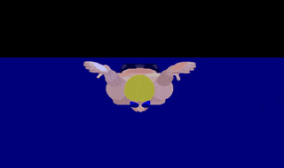
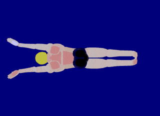

# Butterfly

<figure markdown="span">
    { width="500" }
    <figcaption>Butterfly (images from <a href="https://arenaswim.com/">Arena Swim</a>)</figcaption>
</figure>

Butterfly (or "fly") is a swimming stroke swum on the chest, with both arms moving symmetrically, accompanied by the dolphin kick along with the movement of the hips and chest.
It is the most physically taxing stroke to perform as the arms both recover over the water, requiring a very strong pull.

## **Tips**

{ align=right width="180" }

Butterfly is a symmetric stroke.
All arm movements must reflect each other, pulling in an "S"-shaped pull and an over water recovery.
All kick movements must also reflect each other, kicking dolphin kick (both feet kicking at the same time).

{ align=right width="180" }

There are a few ways to make butterfly easier.
Recover with thumbs pointing down and the back of each hand coming together before entering.
This reduces movement in the shoulders at the beginning of the recovery, and this reduces the amount of the body that needs to exit the water to do the recovery.
In other words, with thumbs pointing down during the recovery, it reduces the strength necessary to perform the recovery (the most physically taxing part of the stroke).
Introducing a small glide after the recovery give the swimmer a small reprieve before each pull.

The kick should also be in sync with the arms.
To help with the recovery, each downward dolphin kick should occur when the arms start the recovery (a big kick) and when the arms start the pull (a small kick).

The following is a chart of skills that will enhance a swimmers butterfly.

+----------+--------------------------------------------------+
| Lesson   | Skill                                            |
+==========+==================================================+
| Stroke   | * kick lines up with arms entering water         |
|          |                                                  |
|          | * kick lines up with arms exiting water          |
|          |                                                  |
|          | * glide before pull                              |
|          |                                                  |
+----------+--------------------------------------------------+
| Kick     | * feet and knees together                        |
|          |                                                  |
|          | * kick from head (worm like motion)              |
|          |                                                  |
|          | * heartbeat kick                                 |
|          |                                                  |
|          | * big kick followed by small kick                |
|          |                                                  |
+----------+--------------------------------------------------+
| Pull     | * order: down and around                         |
|          |                                                  |
|          | * pull in "S"-shape                              |
|          |                                                  |
|          | * recover with straight arms                     |
|          |                                                  |
|          | * recover with thumbs down                       |
|          |                                                  |
|          | * recovery finishes with back of hands  together |
|          |                                                  |
|          | * recovery finishes with glide                   |
|          |                                                  |
|          | * no pause between pull and recovery             |
|          |                                                  |
+----------+--------------------------------------------------+
| Breakout | * underwater dolphin kicks                       |
|          |                                                  |
|          | * normal stroke on breakout                      |
|          |                                                  |
|          | * two hand touch on finish                       |
|          |                                                  |
|          | * open turn                                      |
|          |                                                  |
+----------+--------------------------------------------------+

## **Rules**

The following are the rule for butterfly as defined by USA Swimming.
The butterfly rules are defined in Part 1, Article 101, Section 101.3 in the [USA Swimming Rulebook](https://websitedevsa.blob.core.windows.net/sitefinity/docs/default-source/governance/governance-lsc-website/rules_policies/rulebooks/2024-rulebook.pdf).
See [USA Swimming Rules & Policies](https://www.usaswimming.org/about-usas/governance/rules-policies) for more information.

**101.3** BUTTERFLY

1. **Start** --
The forward start shall be used.

2. **Stroke** --
After the start and after each turn, the swimmer's shoulders must be at or past the vertical toward the breast.
The swimmer is permitted one or more leg kicks, but only one arm pull underwater, which must bring the swimmer to the surface.
It shall be permissible for a swimmer to be completely submerged for a distance of not more than 15 meters (16.4 yards) after the start and after each turn.
By that point, the head must have broken the surface.
The swimmer must remain on the surface until the next turn or finish.
From the begin- ning of the first arm pull, the body shall be kept on the breast except at the turn after the touch of the wall where it is permissible to turn in any manner as long as the body is on the breast when leaving the wall.
Both arms must be brought forward simultaneously over the water and pulled back simultaneously under the water throughout the race.

3. **Kick** --
All up and down movements of the legs and feet must be simultaneous.
The position of the legs or the feet need not be on the same level, but they shall not alternate in relation to each other.
A scissors or breaststroke kicking movement is not permitted.

4. **Turns** --
At each turn the body shall be on the breast.
The touch shall be made with both hands separated and simultaneously at, above, or below the water surface.
Once a touch has been, the swimmer may turn in any manner desired.
The shoulders must be at or past the vertical toward the breast when the swimmer leaves the wall.

5. **Finish** --
At the finish, the body shall be on the breast and the touch shall be made with both hands separated and simultaneously at, above, or below the water surface.
