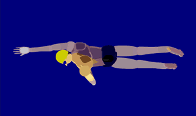
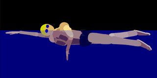

# Freestyle

<figure markdown="span">
    { width="500" }
    <figcaption>Frontstroke (images from <a href="https://arenaswim.com/">Arena Swim</a>)</figcaption>
</figure>

Freestyle is the most common swimming stroke in which competitors are subject to only a few limited restrictions.
Frontstroke (front crawl) is used to swim freestyle as it is, typically, the fastest swim stroke.
Freestyle is often a synonym for frontstroke.

## **Tips**

{ align=right width="180" }

Freestyle uses flutter kick and alternating arm pulls to propel forward.
Swimmers breath to the side while one are is recovering.
Rhythmic breathing should be applied by only breathing every odd number of strokes, typically every 3 or 5 strokes.

{ align=right width="180" }

The best freestyle form has a strong and fast kick and a long reaching pull.
Reaching to the furthest point during the recovery followed by a small glide at the end provides balance.
Each pull should rotate the body enough to allow for a deep mid-pull and a strong finish.
Kicks starting from the hip with pointed feet and a slight bend in the knee provides constant forward progress.

The following is a chart of skills that will enhance a swimmers freestyle.

+----------+--------------------------------------------+
| Lesson   | Skill                                      |
+==========+============================================+
| Kick     | * kick rapidly and small                   |
|          |                                            |
|          | * kick from hip                            |
|          |                                            |
|          | * legs straight (slightly bend)            |
|          |                                            |
|          | * feet pointed                             |
|          |                                            |
+----------+--------------------------------------------+
| Pull     | * pull catch starts when recovery finishes |
|          |                                            |
|          | * pull in "S"-shape                        |
|          |                                            |
|          | * recover with high elbows                 |
|          |                                            |
|          | * recover with hand down                   |
|          |                                            |
|          | * recover with arms reaching               |
|          |                                            |
+----------+--------------------------------------------+
| Breakout | * underwater dolphin or flutter kicks      |
|          |                                            |
|          | * initial stroke with one arm pull         |
|          |                                            |
|          | * one hand touch on finish                 |
|          |                                            |
|          | * flip turn                                |
|          |                                            |
+----------+--------------------------------------------+

## **Rules**

The following are the rule for freestyle as defined by USA Swimming.
The freestyle rules are defined in Part 1, Article 101, Section 101.5 in the [USA Swimming Rulebook](https://websitedevsa.blob.core.windows.net/sitefinity/docs/default-source/governance/governance-lsc-website/rules_policies/rulebooks/2024-rulebook.pdf).
See [USA Swimming Rules & Policies](https://www.usaswimming.org/about-usas/governance/rules-policies) for more information.

**101.5** FREESTYLE

1. **Start** --
The forward start shall be used.

2. **Stroke** --
In an event designated freestyle, the swimmer may swim any style, except that in a medley relay or an individual medley event, freestyle means any style other than butterfly, breaststroke or backstroke.
Some part of the swimmer must break the surface of the water throughout the race, except it shall be permissible for the swimmer to be completely submerged during the turn and for a distance of not more than 15 meters (16.4 yards) after the start and each turn.
By that point the head must have broken the surface.

3. **Turns** --
Upon completion of each length the swimmer must touch the wall.

4. **Finish** --
The swimmer shall have finished the race when any part of his person touches the wall after completing the prescribed distance.
